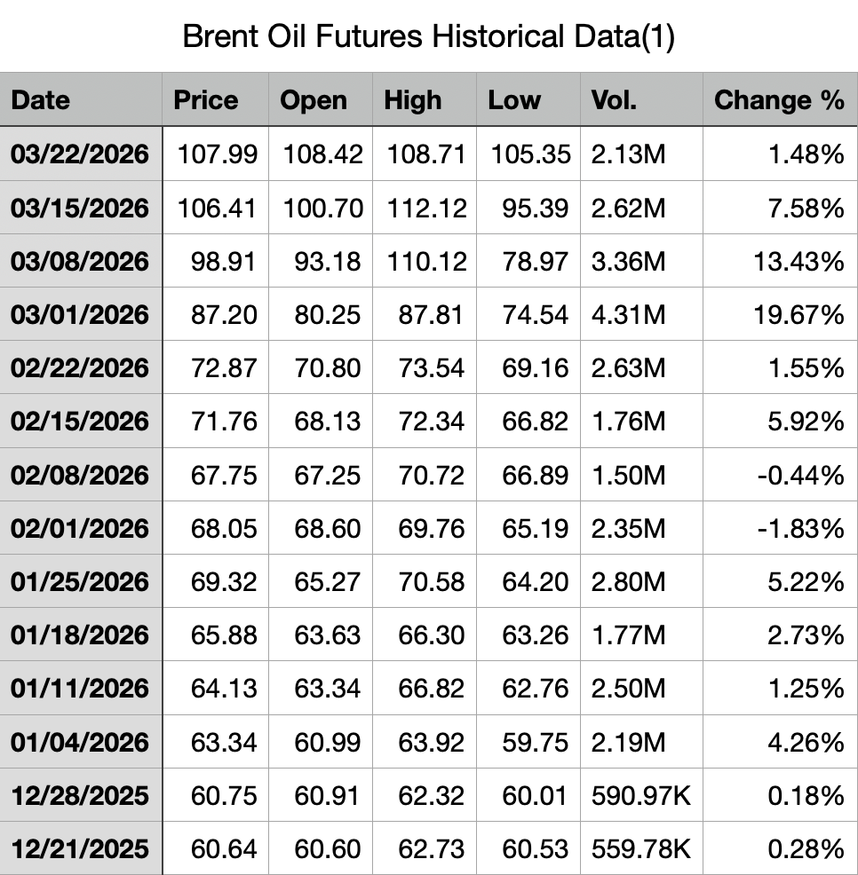
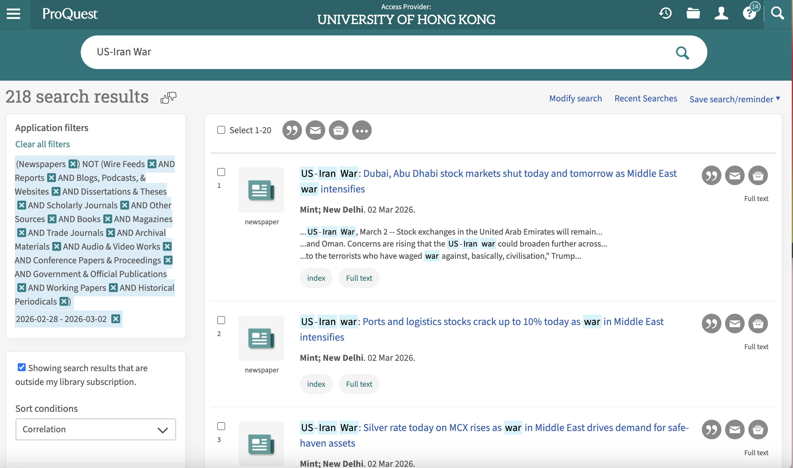
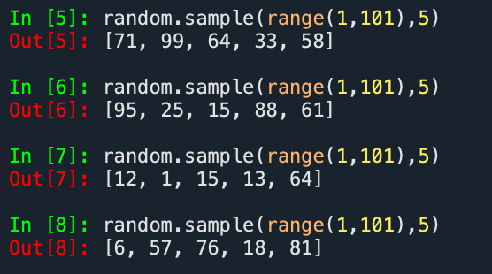
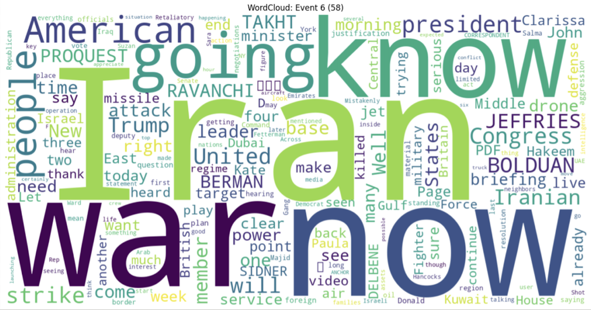
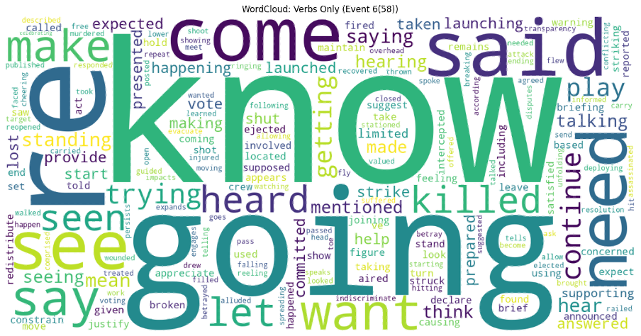
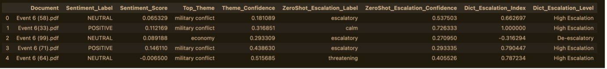
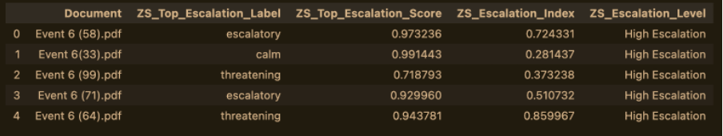
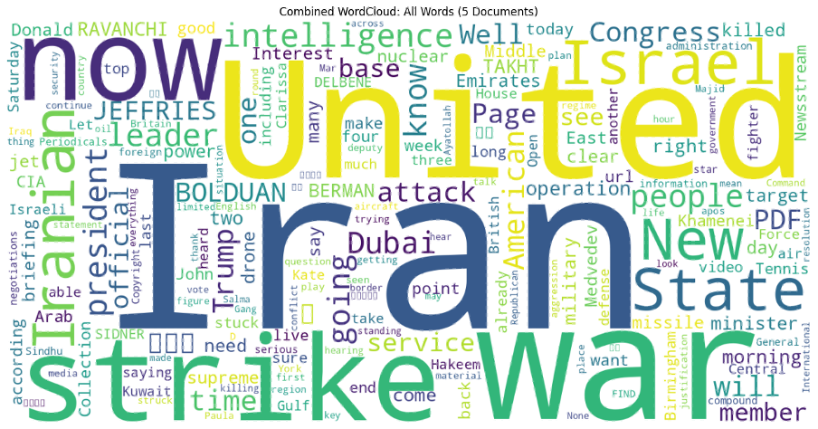

By Group "SENTIBRENT"

## Brent Oil Price Data Collection
In this post, I walk through a Python workflow for collecting and analyzing historical Brent crude oil futures data. The script retrieves price data, segments it into regular intervals (e.g., every three days), calculates price changes, and exports the results to a CSV file. It can also optionally send the processed data to an external API for further use.

To ensure flexibility and reproducibility, the script is designed to prioritize the official Trading Economics API when available, while also providing a fallback to generated sample data. This allows the full workflow to be tested even without API access.

```python
Python
import pandas as pd
import requests
import numpy as np
from datetime import datetime, timedelta
import time
import os

# 1. Configuration parameters
SLICE_DAYS = 3  # Slice interval (days)
OUTPUT_CSV = "brent_crude_3day_slices.csv"
TRADING_ECONOMICS_API_KEY = os.getenv("TRADING_ECONOMICS_API_KEY")
if not TRADING_ECONOMICS_API_KEY:
    try:
        with open("Brent crude Fluctuation.txt", 'r') as f:
            TRADING_ECONOMICS_API_KEY = f.read().strip()

# 2. Define data retrieval functions (API first, scraping fallback)
def fetch_brent_data_via_api(api_key, start_date=06/29/2025, end_date=03/22/2026):
    """
    Fetch Brent crude oil daily data via Trading Economics API
    Documentation: https://api.tradingeconomics.com/documentation
    A free API key is required (daily limit applies)
    """
    if not api_key:
        raise ValueError("No API key provided. Please apply for one and set TRADING_ECONOMICS_API_KEY")
    
    url = f"https://api.tradingeconomics.com/historical/country/commodity?c={api_key}&symbol=COMBRENT&format=json"
    if start_date:
        url += f"&d1={start_date}"
    if end_date:
        url += f"&d2={end_date}"
    
    response = requests.get(url)
    if response.status_code == 200:
        data = response.json()
        df = pd.DataFrame(data)
        df['Date'] = pd.to_datetime(df['DateTime']).dt.date
        df = df[['Date', 'Close']].rename(columns={'Close': 'price'})
        df = df.sort_values('Date').drop_duplicates(subset=['Date'])
        return df
    else:
        raise Exception(f"API request failed: {response.status_code} - {response.text}")

def fetch_brent_data_via_scrape():
    """
    Fallback: scrape from a public website or generate simulated data for demonstration.
    Note: In production, use a reliable data source and respect the website's robots.txt.
    Here we create a sample dataset to illustrate the processing logic.
    """
    print("Fallback mode: generating simulated daily data for the past year")
    # Generate simulated data (for demonstration only)
    end_date = datetime.now().date()
    start_date = end_date - timedelta(days=365)
    dates = pd.date_range(start=start_date, end=end_date, freq='D')
    
    # Simulate Brent crude oil prices ($80-95 with a slight upward trend)
    np.random.seed(42)
    base = 85
    trend = np.linspace(0, 5, len(dates))
    noise = np.random.normal(0, 1, len(dates))
    prices = base + trend + noise.cumsum()
    
    df = pd.DataFrame({'Date': dates.date, 'price': prices})
    return df

# 3. Retrieve real data (try official API; if fails, use fallback)
def get_brent_data():
    try:
        if TRADING_ECONOMICS_API_KEY:
            df = fetch_brent_data_via_api(TRADING_ECONOMICS_API_KEY)
            print(f"Successfully retrieved {len(df)} records via API")
            return df
        else:
            raise ValueError("No API key provided")
    except Exception as e:
        print(f"API method failed: {e}. Switching to fallback...")
        return fetch_brent_data_via_scrape()

# 4. Slice data at intervals and calculate price volatility
def slice_data_and_calc_volatility(df, slice_days):
    """
    For every slice_days days, take a price point and calculate the percentage change
    from the previous slice.
    """
    # Ensure data is sorted by date
    df = df.sort_values('Date').reset_index(drop=True)
    
    # Determine slice dates: start from the earliest date, step by slice_days
    start_date = df['Date'].iloc[0]
    slice_dates = []
    current = start_date
    while current <= df['Date'].iloc[-1]:
        slice_dates.append(current)
        current += timedelta(days=slice_days)
    
    # For each target date, find the closest available price (previous trading day)
    slice_prices = []
    actual_dates = []
    for target_date in slice_dates:
        mask = df['Date'] <= target_date
        if mask.any():
            idx = df[mask].index[-1]
            actual_dates.append(df.loc[idx, 'Date'])
            slice_prices.append(df.loc[idx, 'price'])
        else:
            continue  # No data available (should not happen)
    
    # Build the slice DataFrame
    slice_df = pd.DataFrame({
        'slice_date': [d.strftime('%Y-%m-%d') for d in actual_dates],
        'price': slice_prices
    })
    
    # Calculate price changes (percentage and absolute)
    slice_df['price_change_pct'] = slice_df['price'].pct_change() * 100
    slice_df['price_abs_change'] = slice_df['price'].diff()
    
    return slice_df
```

### Why This Matters
__Brent crude oil__ is one of the most important global benchmarks. Analysts often need to examine price movements over fixed periods – for instance, to compute volatility or feed into a trading model. This script automates the data retrieval and transformation steps, saving time and ensuring reproducibility.

### Code Overview

__1. Configuration__

We begin by defining key parameters, including the slicing interval (SLICE_DAYS = 3) and the output CSV filename.

This design allows for easy customization—you can adjust the interval to 7, 10, or any number of days depending on your analysis needs.

__2. Data Retrieval__

The script supports two methods for obtaining Brent crude oil data:

- __fetch_brent_data_via_api__ uses the Trading Economics API. You’ll need a free API key from tradingeconomics.com/api. The function constructs the appropriate URL, makes a GET request, and returns a cleaned DataFrame with dates and closing prices.

- __fetch_brent_data_via_scrape__ is a fallback that generates realistic simulated data (a year of daily prices with a mild upward trend and random noise). In a real deployment, you could replace this with a proper web scraping routine (e.g., using __requests__ and __BeautifulSoup__), but the simulation ensures the rest of the pipeline runs smoothly for demonstration.

The main function __get_brent_data()__ attempts to use the API first; if that fails (no key or network issues), it silently switches to the simulated data.

__3. Slicing and Volatility Calculation__

__slice_data_and_calc_volatility__ takes the daily price DataFrame and slices it at intervals of slice_days. For each target date, it finds the most recent available price (useful because weekends or holidays might have no data). It then computes:
- __price_change_pct__: percentage change from the previous slice.
- __price_abs_change__: absolute change.
The result is a clean DataFrame with one row per slice, plus the derived columns.
 

__4.  Export__

__export_to_csv__ saves the sliced DataFrame to a CSV file with UTF-8 encoding (compatible with Excel).

__5. External API Call (Optional)__

__send_to_api__ demonstrates how you could push the sliced data to an external endpoint. It builds a JSON payload and prepares headers. You can uncomment the actual __requests.post__ line and supply your own endpoint and token.

### Result



## News Data Collection Process

To ensure a systematic and reliable dataset for our analysis, we designed a three-step data collection process using ProQuest as our primary news source. Our goal is to capture how geopolitical events influence oil prices, while maintaining strong quality control and minimizing selection bias.

### Step 1: Defining Key Event Days (Quality Control)

As a first step, we identify Key Event Days to anchor our analysis. For quality control, we select 8 major event days that represent significant shifts in geopolitical tension between the United States and Iran.
We define an Event Day as a date when there is a sudden escalation, de-escalation, or turning point in conflict intensity or diplomatic stance. These moments are critical because they generate clear market reactions, allowing us to better observe the relationship between geopolitical shocks and oil price movements.

Our selected Key Event Days are:
- Event 1 (Apr 12, 2025): Nuclear Talks Begin
- Event 2 (June 13, 2025): Major Airstrikes Begin
- Event 3 (June 22, 2025): Direct Military Action Reported
- Event 4 (Feb 17, 2026): Increased Tensions in the Strait of Hormuz
- Event 5 (Feb 28, 2026): Onset of Military Conflict
- Event 6 (Mar 1, 2026): Immediate Response Phase
- Event 7 (Mar 13, 2026): Military Activity Reported at Kharg Island
- Event 8 (Mar 18, 2026): Escalation of Tensions in the Strait of Hormuz

By focusing on these high-impact dates, we improve signal clarity and reduce noise from less relevant periods.


### Step 2: Keyword Filtering and Source Selection

Next, we collect news articles from [ProQuest.com](https://www.proquest.com/) and using ProQuest’s built-in filtering tools.
•	Primary keyword: “US-Iran War”
•	Source type filter: Newspapers only



Because ProQuest aggregates a wide range of content (e.g., reports, blogs, and magazines), restricting our dataset to newspaper articles ensures:
•	higher credibility
•	consistent journalistic standards
•	timely reporting of events
This step ensures that our dataset remains both relevant and reliable.

### Step 3: Random Sampling to Reduce Bias

To capture the immediate market reaction to each event, we define a 3-day event period following each Key Event Day. This approach captures both the initial announcement and the short-term reactions reflected in the news.
For each event period:
•	We retrieve the top 100 most relevant articles ranked by ProQuest
•	We then apply a Python-based random sampling method to select 5 articles

The code we use is as follows:
```python
random.sample(range(1,101),5)
```


Then we collect the PDF version of the news for later Data Cleaning and Analysis 
This process ensures that our selection is not influenced by subjective judgment or algorithmic ranking bias.
By combining relevance ranking with random selection, we:
•	reduce the risk of cherry-picking extreme narratives
•	maintain a representative sample of news coverage
•	improve the robustness and validity of our sentiment analysis


## Text Analysis

After collecting the data, we began by conducting a pilot text analysis on a single news article from Event 6. This initial step allowed us to test our workflow before scaling the analysis to a larger dataset.

One of the first challenges we encountered was related to data access. Because our team relied on university access through ProQuest, we were unable to directly specify file paths to the articles without downloading them. To resolve this issue and ensure consistency across team members, we decided to save all selected articles as PDF files for local processing.

Next, we compared two approaches to measuring escalation language: zero-shot classification and a dictionary-based method. Using the same article as a test case, both methods produced similar results. Despite this consistency, we chose to retain both approaches. From a research perspective, applying multiple methods can improve robustness and provide complementary insights. As our later analysis confirmed, this decision proved valuable.

The Code we use as follow:
```python
# 5. Escalatory Language Assessment
# Using Zero-Shot Classification to look for specific signs of escalation

print("Loading model for escalation assessment...")
zero_shot_pipeline = pipeline("zero-shot-classification", model="facebook/bart-large-mnli")

def assess_escalation(text):
    if not text or len(text) < 10:
        return {"label": "NEUTRAL", "score": 0.0}

    # Restrict text length for the model
    short_text = " ".join(text.split()[:400])

    # Labels we want to check for
    candidate_labels = ["escalatory", "threatening", "aggressive", "calm", "neutral", "peaceful"]

    try:
        # The model will return labels sorted by probability
        result = zero_shot_pipeline(short_text, candidate_labels)

        # Taking the label with the highest probability
        top_label = result["labels"][0]
        top_score = result["scores"][0]

        return {"label": top_label, "score": top_score}

    except Exception as e:
        print(f"Analysis error: {e}")
        return {"label": "ERROR", "score": 0.0}
```
### Word Cloud Creation

Next, we created word clouds. We thought it might be useful to generate a separate word cloud containing only verbs, as higher levels of escalation in the news might be reflected more clearly through action-oriented language. However, this step was mainly exploratory and served as a space for experimentation.






### Comparing Escalation Signals Across Methods
To analyze all news articles related to Event 6, we applied two different approaches: __a dictionary-based method__ and __a zero-shot classification model__. Our goal was to compare how each method captures escalation language and to identify any meaningful differences between them.

The code we use as follow:
```python
df_all = pd.DataFrame(all_docs)
print(f"\n✅ Extracted valid text from {len(df_all)} files.")

if not df_all.empty:
    # 3. Sentiment Analysis
    print("🔍 Running Sentiment Analysis on all documents...")
    df_all['Sentiment_Result'] = df_all['Text'].apply(analyze_sentiment)
    df_all['Sentiment_Label'] = df_all['Sentiment_Result'].apply(lambda x: x['label'])
    df_all['Sentiment_Score'] = df_all['Sentiment_Result'].apply(lambda x: x['score'])

    # 4. Thematic Analysis
    print("🔍 Running Thematic Analysis on all documents...")
    df_all['Theme_Result'] = df_all['Text'].apply(combined_assess_theme)
    df_all['Top_Theme'] = df_all['Theme_Result'].apply(lambda x: x['label'])
    df_all['Theme_Confidence'] = df_all['Theme_Result'].apply(lambda x: x['score'])

    # 5. Zero-Shot Escalation Assessment
    print("🔍 Running Zero-Shot Escalation Assessment on all documents...")
    df_all['Esc_Result'] = df_all['Text'].apply(combined_assess_escalation)
    df_all['ZeroShot_Escalation_Label'] = df_all['Esc_Result'].apply(lambda x: x['label'])
    df_all['ZeroShot_Escalation_Confidence'] = df_all['Esc_Result'].apply(lambda x: x['score'])

    # 6. Dictionary-based Escalation Index
    print("🔍 Running Dictionary-Based Escalation Assessment on all documents...")
    df_all['Dict_Esc_Result'] = df_all['Text'].apply(lambda t: combined_assess_escalation_dictionary(t, escalation_lexicon_combined))
    df_all['Dict_Escalation_Index'] = df_all['Dict_Esc_Result'].apply(lambda x: x['escalation_index'])
    df_all['Dict_Escalation_Level'] = df_all['Dict_Escalation_Index'].apply(combined_escalation_level)

    # Clean up intermediate cols
    df_all = df_all.drop(columns=['Sentiment_Result', 'Theme_Result', 'Esc_Result', 'Dict_Esc_Result'])

    print("\n🎉 --- COMPILED ANALYSIS RESULTS ---")
    display(df_all.drop(columns=['Text']))
```
The figure below show the classification results and highlights the differences between the two approaches across selected documents.





The metric __ZS_Top_Escalation_Score__ represents the model’s confidence in its most likely predicted label.

We also can see that escalation level from dictionary based and zero-shot model differs for event 6 (99). This might suggest that we should reconsider the escalation_lexicon parameter. 

Additionally, our preliminary findings indicate that sentiment scores and escalation indices are not directly correlated. For example, a piece of news can contain highly escalatory language while maintaining a neutral tone. While this observation is intuitive, we plan to validate it more rigorously using statistical methods in later stages of the analysis.

Typical potential scenarios for news:

- __Low Sentiment (-0.5) + High Escalation threatening (0.9)__: The text describes a serious impending crisis, threats, or aggressive statements.
- __Neutral Sentiment (~0.0) + Low  Escalation (<0.5)__: A standard, dry news report; no strong emotions and no obvious signs of escalation.
- __High Sentiment (+0.6) + High Escalation peaceful (0.8)__ : The discussion focuses on de-escalation, signing a peace treaty, successful negotiations, or providing humanitarian aid.

### Data Cleaning Challenges in Visualization
During the construction of word clouds for Event 6, we encountered a data-cleaning issue: the word “__quest__” appeared frequently due to ProQuest document stamps rather than actual article content.

To address this, we added “quest” to our stopword list, ensuring that the visualization more accurately reflects meaningful linguistic patterns.

 

