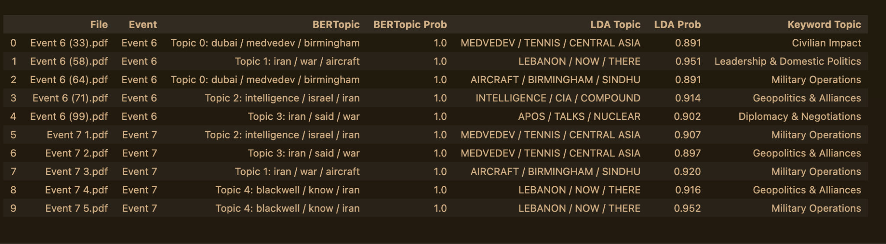
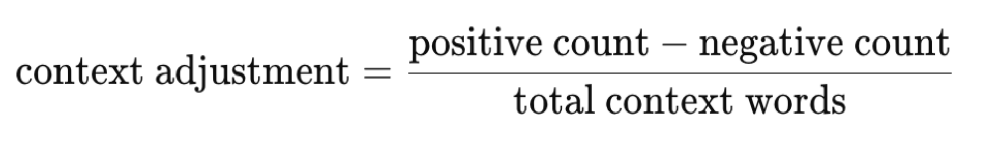
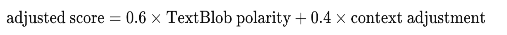
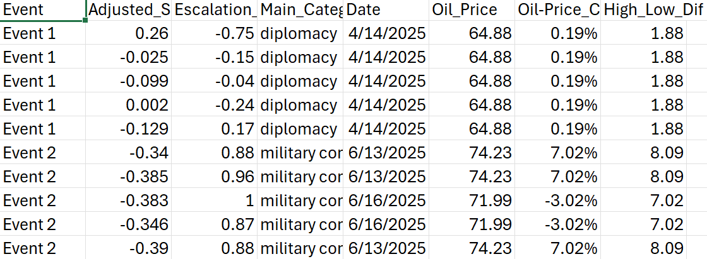
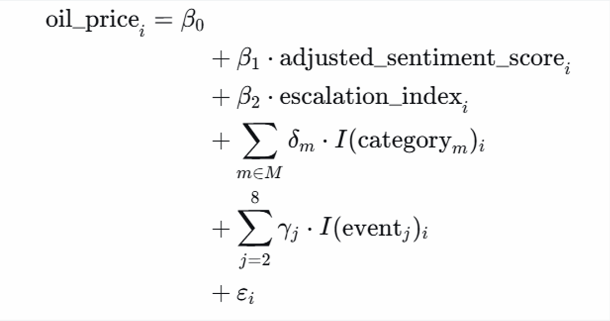
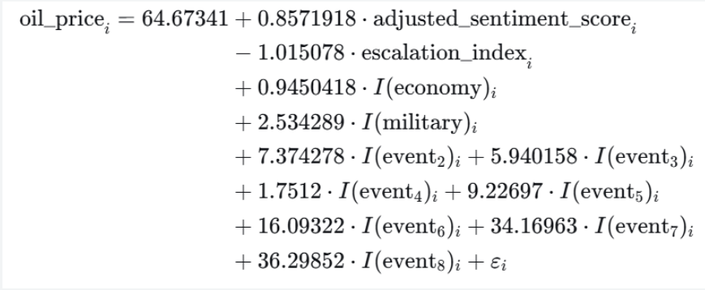
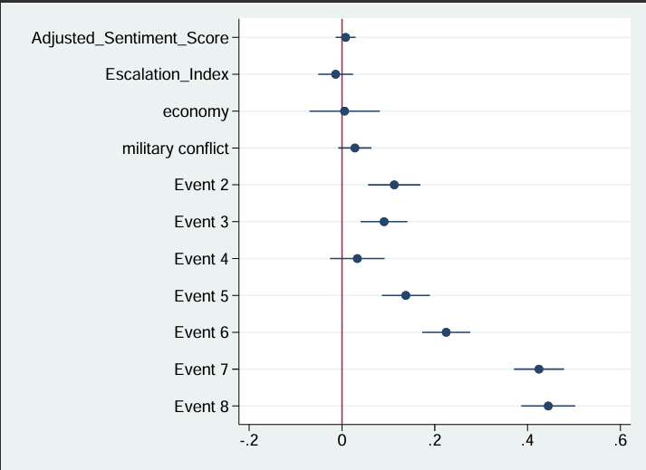

## Group SENTIBRENT: Analyzing the Geopolitical Impact on Brent Crude Oil

As part of our course on NLP and Text Analysis in Financial Usage, our group, **SENTIBRENT**, aimed to uncover the relationship between the stock fluctuations of Brent crude oil and US-Iran news [cite: 1, 10]. By combining sophisticated NLP models with econometric regression, we established a pipeline that links geopolitical text data directly to market movements.

During our initial implementation, we encountered a critical issue: when applying TextBlob sentiment analysis, the majority of articles were labeled as positive, which was inconsistent with the geopolitical context of our dataset. Given that our sample focuses on U.S.–Iran tensions, military actions, and escalation risk, this result indicated a clear measurement problem.

For events (event 6 and event 7), we tried different approaches that we covered in class because we were interested in how different the results would be. After verifying the feasibility, we would apply it wider.

## Text Labeling
For topic labeling we used three approaches - BERTopic, LDA and the keyword-based.

The keyword-based approach served as our baseline. We defined seven manually curated topic categories — Military Operations, Diplomacy & Negotiations, Civilian Impact, Geopolitics & Alliances, Nuclear Program, Leadership & Domestic Politics, and Media and Information War - each populated with domain-specific keyword lists. For every article, we counted regex-matched keyword hits per category and assigned the highest-scoring category as the primary topic, provided it met a minimum threshold of two hits. While straightforward and interpretable, this method is limited by its reliance on manual keyword selection, its inability to disambiguate polysemous words, and its complete lack of contextual understanding.

First, we should look back at our oil price list below.


Then, we give out the COMPARISON: BERTOPIC vs LDA vs KEYWORD TOPIC LABELING by Sentiment analysis.


BERTopic represents the most semantically sophisticated approach in our comparison. Rather than relying on word counts or frequency weights, it begins by encoding each document into a dense 384-dimensional vector using the all-MiniLM-L6-v2 sentence transformer, which captures contextual meaning. 
Unlike LDA, BERTopic does not require the number of topics to be specified in advance — HDBSCAN discovers clusters organically and identifies outlier documents that do not fit any topic (assigned topic ID −1). Topic representations are then extracted using class-based TF-IDF, which identifies the most representative words per cluster. This pipeline yields both a topic label and an assignment probability for each article, along with explicit outlier detection.

```python
Python
import pandas as pd
import requests
import numpy as np
from datetime import datetime, timedelta
import time
import os

# Build BERTopic model with custom vectorizer (removes stopwords from topic labels)
vectorizer_model = CountVectorizer(
    stop_words='english',
    ngram_range=(1, 2),
    min_df=1
)

topic_model = BERTopic(
    embedding_model=embedding_model,
    umap_model=umap_model,
    hdbscan_model=hdbscan_model,
    vectorizer_model=vectorizer_model,
    verbose=False,
    language='english'
)

# — 3. Fit the model —
topics, probs = topic_model.fit_transform(raw_texts)

# — 4. Display discovered topics —
topic_info = topic_model.get_topic_info()
print("\n" + "=" * 70)
print(f"BERTOPIC RESULTS | {len(raw_texts)} documents | {len(topic_info)-1} topics discovered")
print("=" * 70)
print(f"\nTopic Overview:")
display(topic_info)

# — 5. Show top words per topic —
print("\n" + "=" * 70)
print("TOP WORDS PER TOPIC (c-TF-IDF)")
print("=" * 70)
for topic_id in sorted(topic_model.get_topics().keys()):
    topic_words = topic_model.get_topic(topic_id)
    if topic_id == -1:
        # ... (continues)
```

LDA, by contrast, is an unsupervised generative model that discovers latent topics from the text itself, without any predefined categories. We built a two-step pipeline: first, TF-IDF vectorization converted the preprocessed text into a document-term matrix weighted by term frequency–inverse document frequency, which downweights common words and highlights distinctive terms; second, an LDA model with k = 7 topics (chosen to match the keyword approach) was fitted to this matrix. Each article was then represented as a probability distribution over all seven topics, with the highest-probability topic taken as the primary assignment. This probabilistic framing is a key advantage — rather than a single hard label, LDA captures the mixture of themes within each document. However, LDA operates on a bag-of-words representation and cannot account for word order or semantic context.

## Identifying the Root Cause

During early runs, **TextBlob** labeled most articles as positive — implausible for U.S.–Iran conflict coverage. To diagnose why, we manually compared several articles with their sentiment outputs. TextBlob mainly reflects general linguistic polarity and misses domain-specific negative signals. In formal news writing, conflict is often phrased in neutral terms, so words such as “attack,” “strike,” “missile,” “threat,” “conflict,” “escalation,” “military,” “killed,” and “tension” were not consistently treated as negative, which biased scores upward.

## Model Adjustment Using Conflict Context
To address this limitation, we upgraded our sentiment model by incorporating a context-based adjustment directly into our code. Specifically, for each article:
•We first compute the raw TextBlob polarity score (raw_score)
•Then, we define two domain-specific dictionaries:
◦Negative context words (e.g., war, attack, missile, escalation, invasion)
◦Positive context words (e.g., peace, agreement, ceasefire, negotiation)
Next, the model counts the frequency of these words:
•negative_count: total occurrences of conflict-related words
•positive_count: total occurrences of de-escalation words
We then construct a context adjustment term:


This captures whether the article leans toward escalation or de-escalation in its language.



This weighted approach ensures that:
•TextBlob provides a baseline sentiment measure
•The context adjustment introduces geopolitical relevance

## Final Classification
Based on the adjusted score, we assign sentiment labels:
•Positive: score ≥ 0.05
•Negative: score ≤ −0.05
•Neutral: between −0.05 and 0.05

## Final Adjusted Sentiment Score

We balance the raw TextBlob polarity with the conflict-context adjustment in code as follows.

```python
=========================================================
# IMPROVE!! Upgraded Sentiment Model
# TextBlob + conflict adjustment
=========================================================
def analyze_sentiment_upgraded(text):
    blob = TextBlob(text)
    raw_score = blob.sentiment.polarity

    text_lower = text.lower()

    negative_context_words = [
        "war", "attack", "strike", "missile", "threat",
        "conflict", "escalation", "military", "damage",
        "killed", "invasion", "tension", "blockade",
        "hostilities", "force", "coercion"
    ]

    positive_context_words = [
        "peace", "agreement", "ceasefire", "negotiation",
        "resolution", "cooperation", "stability", "reopen"
    ]

    negative_count = sum(text_lower.count(w) for w in negative_context_words)
    positive_count = sum(text_lower.count(w) for w in positive_context_words)

    total_context = negative_count + positive_count

    if total_context == 0:
        adjusted_score = raw_score
    else:
        context_adjustment = (positive_count - negative_count) / total_context
        adjusted_score = 0.6 * raw_score + 0.4 * context_adjustment

    if adjusted_score > 0.05:
        label = "POSITIVE"
    elif adjusted_score < -0.05:
        label = "NEGATIVE"
    else:
        label = "NEUTRAL"

    return {
        "raw_textblob_score": raw_score,
        "adjusted_score": adjusted_score,
        "label": label,
        "negative_context_count": negative_count,
        "positive_context_count": positive_count
    }
```

Importantly, this approach allows us to retain TextBlob’s smoother and more discriminating score distribution for regression analysis, while correcting its inability to recognize geopolitical risk language. Compared to VADER, which tends to produce extreme scores and react to formatting (e.g., capitalization and punctuation), our adjusted measure preserves meaningful variation across articles and reduces systematic measurement error. As a result, the final sentiment variable better reflects the true informational content of conflict news and provides a more reliable independent variable for explaining oil price movements.

## Regression Process
With the sentiment scores and escalation index, we can continue to use a regression model to estimate the causal effects of escalation index & sentiment scores in newspapers on the Brent crude oil prices during the US-Iran conflict.

Before doing the regression, we need to further collate and clean our data. The below figure shows an example about features of data we consider, e.g., events, adjusted sentiment scores, escalation index, main categories, publication date (or the relevant newspaper), oil prices, etc.



One problem we faced is that merely escalation index & sentiment score cannot well explain the oil prices changes. Our solution is to add two more independent variables: category fixed effect and event fixed effect.

“Fixed effect” means the existence of a certain category/event, with all other variables constant, will have a fixed effect on the oil price. But different categories/events have fixed effects of different magnitude. Such effects will be captured by our coefficients in the regression.

We classify the topics of each newspaper into three themes: diplomacy, economy, and military conflict. We add this variable, because we think some investors mainly look at category of the items in the newspapers when making oil transaction decisions.

We, based on time frames, classify the overall US-Iran conflicts into eight events. This is because oil prices get escalated as the conflict is increasing serious over time.

Therefore, our regression formula is that:



We then use Stata commands to run the regression. To fully capture the price changes, we think of three dependent variables. In other words, we regress (1) oil price; (2) the difference between highest and lowest oil price per day; (3) log(price) over the independent variables. However, after consideration of statistical significance and interpretation, our best results occur in (1) oil price regression. The exact code is as below:
```python
 import delimited using "fina2350_new.csv", varnames(1) encoding(UTF-8) clear

  save "fina2350_new.csv", replace

  encode main_category, gen(main_category_id)

  encode event, gen(event_id)

  destring oilprice_change, replace ignore("%")

  regress oil_price adjusted_sentiment_score escalation_index i.main_category_id i.event_id

  regress high_low_dif adjusted_sentiment_score escalation_index i.main_category_id i.event_id, level(90)

  regress ln_price adjusted_sentiment_score escalation_index i.main_category_id i.event_id

  ssc install coefplot, replace

  coefplot, drop(_cons) xline(0)
```

After the regression, we visualize the results via a clearer formula (with coefficients) and a coefficient plot (The “Dot-and-Whisker” Plot). The selected confidence interval for this regression is 95% to ensure more accurate predictions. The R-square is about 0.97, a good capture of overall effects of different factors on oil pricure.



In the coefficient plot, 
The causal effect of escalation index over the oil price is -1.01, a small negative influence. This points out that most investors may not pay some attention to the escalatory words (e.g., war) in a long newspaper. Instead, they care more about the generael picture, including the category of newspapers and the occurance of world events 

It is clear that, as time goes by, event takes palce in order, the US-Iran conflict is more serious, and the coefficient for the event fixed effects becomes larger (from 7.37-36.30) and has more effects on the oil prices.



### Key Results
1.  _Model Fit_ : The model achieved an R-square of approximately 0.97, indicating a very strong capture of the overall effects on oil prices [cite: 19].
2. _Escalation Impact_: Interestingly, the causal effect of the escalation index on oil price was -1.01 (a small negative influence) [cite: 21]. This suggests investors don't strictly react to escalatory vocabulary embedded deep within long news articles [cite: 22].
3. _The Big Picture_: Instead of granular word sentiment, investors care heavily about the macro environment. The fixed effects for the general category of the news and the specific timeline of events were highly significant [cite: 23].
4. _Temporal Severity_: As the timeline progressed and the conflict deepened (Events 2 through 8), the coefficients for the event fixed effects massively increased from 7.37 up to 36.30 [cite: 24].

By merging advanced language modeling, including BERTopic, Context-Adjusted Sentiment, with strict econometric methodology of Fixed-Effects Regression, we completely mapped the nuanced ways geopolitical news translates into global energy market fluctuations in the end.